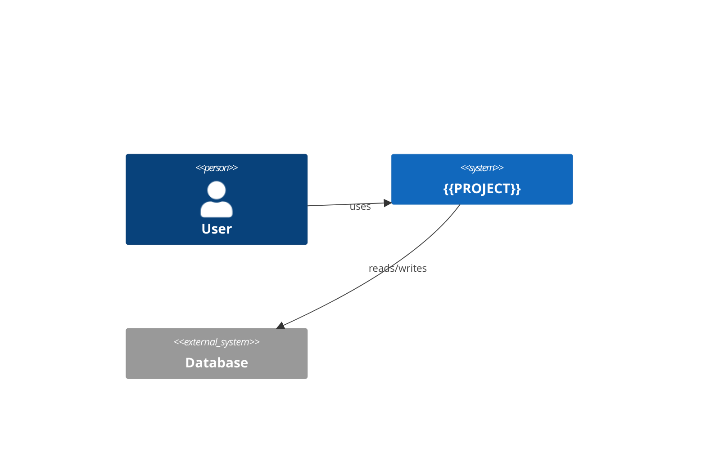

# campanha-dev-standards `core` plugin — Implementation Plan

> **For agentic workers:** REQUIRED SUB-SKILL: Use superpowers:subagent-driven-development (recommended) or superpowers:executing-plans to implement this plan task-by-task. Steps use checkbox (`- [ ]`) syntax for tracking.

**Goal:** Build the `core` Claude Code plugin, its marketplace repo and `install.sh`, so that `/adopt` can be run on the pilot project.

**Architecture:** A public GitHub repo `stickman874/campanha-dev-standards` that is a Claude Code marketplace with one plugin `core`. The plugin ships shell hooks (deterministic gates), one agent (`doc-keeper`), three skills (`codex-review`, `security-posture`, `handoff`), two commands (`/adopt`, `/docs-consolidate`) and templates copied into projects. Scanners (gitleaks, semgrep, trivy) run through lefthook in each project; the plugin's hooks stop Claude from bypassing them.

**Tech Stack:** Bash + jq (hooks, scripts), Markdown (agent/skills/commands/templates), lefthook, gitleaks, semgrep, trivy, Playwright CLI, Claude Code plugin format (`.claude-plugin/plugin.json`, `hooks/hooks.json`).

**Spec:** `docs/superpowers/specs/2026-09-10-campanha-dev-standards-design.md`

## Global Constraints

- All docs, comments and commit messages in English. Claude answers in the user's language.
- Company-agnostic: no company or client name anywhere in the plugin.
- Hooks are bash, depend only on `jq`, `git`, `grep`. Exit 0 always; deny via JSON `permissionDecision`.
- No new runtime dependencies beyond: lefthook, gitleaks, semgrep, trivy, Playwright CLI + Chrome, Codex CLI (`codex-plugin-cc`).
- Every shell script gets one runnable check in `tests/`. Run all with `bash tests/run.sh`.
- Never put a literal secret-shaped string (e.g. a `ghp_` token) in any file or command: the global secrets hook denies it. Build test tokens at runtime with `printf`.
- Commit after every task. Commit messages end with `Co-Authored-By: Claude Fable 5.1 <noreply@anthropic.com>`.
- Ponytail level lite: smallest change at the right level.

## Out of scope for this plan

Migrating the 10 existing projects (`/adopt` in migration mode over real repos). That is a second plan once this plugin is installable. This plan ends when `/adopt` works on a throwaway fixture repo and the plugin installs from GitHub.

---

## File structure

```
campanha-dev-standards/
  .claude-plugin/marketplace.json        marketplace manifest (one plugin: ./plugins/core)
  README.md                              what it is, install in 3 commands
  install.sh                             installs lefthook/gitleaks/semgrep/trivy/playwright-chrome, checks codex
  tests/run.sh                           runs every tests/*.test.sh
  tests/lib.sh                           assert helpers
  tests/*.test.sh                        one per script
  tests/fixtures/README.md               manual smoke with Claude
  plugins/core/
    .claude-plugin/plugin.json
    hooks/hooks.json                     wiring
    hooks/block-secrets.sh               moved from ~/.claude/hooks (PreToolUse Bash)
    hooks/block-unsafe-bash.sh           PreToolUse Bash: --no-verify, .env reads, db push/reset
    hooks/pre-push-gate.sh               PreToolUse Bash on `git push`: review+docs markers + lefthook
    agents/doc-keeper.md
    skills/codex-review/SKILL.md
    skills/security-posture/SKILL.md
    skills/handoff/SKILL.md
    commands/adopt.md                    /adopt → runs scripts/adopt.sh then doc-keeper bootstrap
    commands/docs-consolidate.md         /docs-consolidate → doc-keeper consolidate mode
    scripts/adopt.sh                     deterministic part of /adopt (copy templates, lefthook install)
    scripts/design-lint.sh               fails on hardcoded colours / arbitrary Tailwind values
    templates/
      AGENTS.md CLAUDE.md README.md CHANGELOG.md SECURITY.md
      public/.well-known/security.txt
      lefthook.yml
      .claude/settings.json
      .claude/rules/database.md .claude/rules/api.md .claude/rules/frontend.md
      docs/dev/architecture.md
      docs/dev/decisions/0000-template.md
      docs/dev/how-to/{deploy,rollback,rotate-secrets,restore-backup,incident}.md
      docs/dev/reference/{data-model,env-vars,endpoints,integrations}.md
      docs/dev/explanation/security.md
      docs/dev/handoffs/.gitkeep  docs/dev/specs/.gitkeep  docs/dev/plans/.gitkeep  docs/dev/research/.gitkeep
      docs/product/{roles,glossary}.md  docs/product/features/.gitkeep  docs/product/manual/.gitkeep
```

---

### Task 1: Repo scaffold, marketplace manifest, test harness

**Files:**
- Create: `.claude-plugin/marketplace.json`, `plugins/core/.claude-plugin/plugin.json`, `README.md`, `tests/run.sh`, `tests/lib.sh`, `tests/manifest.test.sh`, `.gitignore`

**Interfaces:**
- Produces: `tests/lib.sh` with `assert_eq <expected> <actual> <msg>`, `assert_contains <haystack> <needle> <msg>`, `assert_exit <code> <cmd...>`, `finish`; `tests/run.sh` exits non-zero if any test fails.

- [ ] **Step 1: Write the failing test**

`tests/lib.sh`:
```bash
#!/usr/bin/env bash
FAILS=0
assert_eq() { [ "$1" = "$2" ] && echo "  ok  $3" || { echo "  FAIL $3: expected [$1] got [$2]"; FAILS=$((FAILS+1)); }; }
assert_contains() { printf '%s' "$1" | grep -q -- "$2" && echo "  ok  $3" || { echo "  FAIL $3: [$2] not in output"; FAILS=$((FAILS+1)); }; }
assert_exit() { local want=$1; shift; "$@" >/dev/null 2>&1; local got=$?; assert_eq "$want" "$got" "exit code of: $*"; }
finish() { [ $FAILS -eq 0 ] && exit 0 || exit 1; }
```

`tests/run.sh`:
```bash
#!/usr/bin/env bash
cd "$(dirname "$0")/.." || exit 1
rc=0
for t in tests/*.test.sh; do echo "== $t"; bash "$t" || rc=1; done
exit $rc
```

`tests/manifest.test.sh`:
```bash
#!/usr/bin/env bash
source "$(dirname "$0")/lib.sh"
m=.claude-plugin/marketplace.json; p=plugins/core/.claude-plugin/plugin.json
assert_eq campanha-dev-standards "$(jq -r .name $m)" "marketplace name"
assert_eq ./plugins/core "$(jq -r '.plugins[0].source' $m)" "plugin source path"
assert_eq core "$(jq -r .name $p)" "plugin name"
assert_eq ./hooks/hooks.json "$(jq -r .hooks $p)" "plugin hooks pointer"
finish
```

- [ ] **Step 2: Run test to verify it fails**

Run: `bash tests/run.sh`
Expected: FAIL (files missing, jq errors)

- [ ] **Step 3: Write the manifests and README**

`.claude-plugin/marketplace.json`:
```json
{
  "$schema": "https://anthropic.com/claude-code/marketplace.schema.json",
  "name": "campanha-dev-standards",
  "description": "One development methodology for every project: gates, living docs, security posture. Company-agnostic.",
  "owner": { "name": "PMC", "url": "https://github.com/stickman874" },
  "plugins": [
    {
      "name": "core",
      "description": "Hooks, doc-keeper agent, codex-review / security-posture / handoff skills, /adopt and /docs-consolidate commands, project templates.",
      "source": "./plugins/core",
      "category": "productivity"
    }
  ]
}
```

`plugins/core/.claude-plugin/plugin.json`:
```json
{
  "name": "core",
  "version": "0.1.0",
  "description": "Gates, living documentation and security posture for every project.",
  "author": { "name": "PMC", "url": "https://github.com/stickman874" },
  "hooks": "./hooks/hooks.json"
}
```

`.gitignore`:
```
tests/tmp/
```

`README.md`:
```markdown
# campanha-dev-standards

One development methodology for every project I work on. Company-agnostic. Claude Code plugin + git hooks + three scanners.

## Install (once per person)

    bash <(curl -fsSL https://raw.githubusercontent.com/stickman874/campanha-dev-standards/main/install.sh)

Then inside Claude Code:

    /plugin marketplace add stickman874/campanha-dev-standards
    /plugin install core@campanha-dev-standards
    /plugin marketplace add openai/codex-plugin-cc
    /plugin install codex@openai-codex

## Bring a project up to standard (once per repo)

    /adopt

## What you get

- Commit: gitleaks + lint + design lint (no hardcoded colours/sizes).
- Push: typecheck + tests + semgrep + trivy. Claude cannot bypass them.
- Claude push: Codex adversarial review + doc-keeper updates docs and CHANGELOG first.
- `docs/dev` (builders) and `docs/product` (users, manuals) kept current by `doc-keeper`.
- `/docs-consolidate` weekly: docs vs code drift → PR.

See `docs/superpowers/specs/` for the design.

## Develop the plugin

    claude --plugin-dir ./plugins/core
    bash tests/run.sh
```

- [ ] **Step 4: Run tests**

Run: `bash tests/run.sh`
Expected: all `ok`, exit 0

- [ ] **Step 5: Commit**

```bash
git add -A && git commit -m "feat: marketplace and plugin manifests, test harness, README

Co-Authored-By: Claude Fable 5.1 <noreply@anthropic.com>"
```

---

### Task 2: Hook `block-secrets.sh` (moved from global) and `block-unsafe-bash.sh`

**Files:**
- Create: `plugins/core/hooks/block-secrets.sh` (copy of `~/.claude/hooks/block-secrets-in-bash.sh`, unchanged), `plugins/core/hooks/block-unsafe-bash.sh`, `tests/hooks-bash.test.sh`

**Interfaces:**
- Consumes: Claude PreToolUse JSON on stdin: `{"tool_name":"Bash","tool_input":{"command":"..."}}`.
- Produces: on deny, prints `{"hookSpecificOutput":{"hookEventName":"PreToolUse","permissionDecision":"deny","permissionDecisionReason":"..."}}`; on allow prints nothing. Always exit 0.

- [ ] **Step 1: Write the failing test**

`tests/hooks-bash.test.sh`:
```bash
#!/usr/bin/env bash
source "$(dirname "$0")/lib.sh"
H=plugins/core/hooks
run() { jq -nc --arg c "$2" '{tool_name:"Bash",tool_input:{command:$c}}' | bash "$H/$1"; }
deny() { assert_contains "$(run "$1" "$2")" '"deny"' "$1 denies: $2"; }
allow() { assert_eq "" "$(run "$1" "$2")" "$1 allows: $2"; }

# build a token-shaped string at runtime so no literal secret shape lives in the repo
fake_gh="ghp_$(printf 'a%.0s' $(seq 1 36))"
deny  block-secrets.sh "echo $fake_gh"
allow block-secrets.sh 'git status'

deny  block-unsafe-bash.sh 'git commit -m x --no-verify'
deny  block-unsafe-bash.sh 'git push --no-verify'
deny  block-unsafe-bash.sh 'cat .env'
deny  block-unsafe-bash.sh 'cd app && cat .env.local'
deny  block-unsafe-bash.sh 'source .env.production'
allow block-unsafe-bash.sh 'cat .env.example'
deny  block-unsafe-bash.sh 'npx prisma db push'
deny  block-unsafe-bash.sh 'supabase db reset --linked'
deny  block-unsafe-bash.sh 'npx prisma migrate reset'
allow block-unsafe-bash.sh 'npx prisma migrate dev --name add_x'
allow block-unsafe-bash.sh 'supabase db reset'
allow block-unsafe-bash.sh 'git push origin main'
finish
```

- [ ] **Step 2: Run test to verify it fails**

Run: `bash tests/hooks-bash.test.sh`
Expected: FAIL (scripts missing)

- [ ] **Step 3: Write the hooks**

```bash
cp ~/.claude/hooks/block-secrets-in-bash.sh plugins/core/hooks/block-secrets.sh
```

`plugins/core/hooks/block-unsafe-bash.sh`:
```bash
#!/usr/bin/env bash
# PreToolUse/Bash: deny commands that bypass gates or touch secrets/production data.
cmd=$(jq -r '.tool_input.command // ""')
deny() { jq -nc --arg r "$1" '{hookSpecificOutput:{hookEventName:"PreToolUse",permissionDecision:"deny",permissionDecisionReason:$r}}'; exit 0; }

printf '%s' "$cmd" | grep -Eq -- '--no-verify|--no-gpg-sign' \
  && deny "Git hooks are the quality gate. Never bypass them with --no-verify; fix what the hook reports."

# any .env file except .env.example
if printf '%s' "$cmd" | grep -Eq '(^|[^A-Za-z0-9_./-])\.env(\.[A-Za-z0-9_-]+)?($|[^A-Za-z0-9_.-])' \
   && ! printf '%s' "$cmd" | grep -Eq '\.env\.example'; then
  deny "Reading .env files is blocked: secrets must never enter the transcript. Use .env.example to see variable names."
fi

printf '%s' "$cmd" | grep -Eq 'prisma (db push|migrate reset)' \
  && deny "prisma db push / migrate reset are forbidden. Use 'prisma migrate dev --name <name>' and never reset a shared database."

printf '%s' "$cmd" | grep -Eq 'supabase db reset.*--linked' \
  && deny "supabase db reset --linked targets the remote project. Local reset only."

exit 0
```

- [ ] **Step 4: Run tests**

Run: `bash tests/hooks-bash.test.sh`
Expected: all `ok`

- [ ] **Step 5: Commit**

```bash
git add -A && git commit -m "feat(hooks): block secrets, --no-verify, .env reads, destructive db commands

Co-Authored-By: Claude Fable 5.1 <noreply@anthropic.com>"
```

---

### Task 3: Hook `pre-push-gate.sh`

**Files:**
- Create: `plugins/core/hooks/pre-push-gate.sh`, `tests/hooks-push.test.sh`

**Interfaces:**
- Consumes: PreToolUse JSON; acts only when the command contains `git push`.
- Contract with Claude: before pushing, Claude must have (a) run the `codex-review` skill and (b) invoked `doc-keeper` mode push. Each writes a marker file `.git/campanha/reviewed-<HEAD-sha>` / `.git/campanha/docs-<HEAD-sha>` (Tasks 4 and 6 say so). The hook denies the push if a marker for the current HEAD is missing, then runs `lefthook run pre-push` and denies on failure.
- Produces: deny JSON with the missing step named.

- [ ] **Step 1: Write the failing test**

`tests/hooks-push.test.sh`:
```bash
#!/usr/bin/env bash
source "$(dirname "$0")/lib.sh"
H=$PWD/plugins/core/hooks/pre-push-gate.sh
T=$(mktemp -d); cd "$T" && git init -q && git -c user.name=t -c user.email=t@t commit -q --allow-empty -m init
sha=$(git rev-parse HEAD)
run() { jq -nc --arg c "$1" '{tool_name:"Bash",tool_input:{command:$c}}' | bash "$H"; }

assert_eq "" "$(run 'git status')" "ignores non-push"
assert_contains "$(run 'git push')" 'codex-review' "denies without review marker"
mkdir -p .git/campanha && touch .git/campanha/reviewed-$sha
assert_contains "$(run 'git push origin main')" 'doc-keeper' "denies without docs marker"
touch .git/campanha/docs-$sha
assert_eq "" "$(run 'git push')" "allows when markers present and no lefthook"
printf 'pre-push:\n  commands:\n    fail:\n      run: exit 1\n' > lefthook.yml
if command -v lefthook >/dev/null; then
  assert_contains "$(run 'git push')" 'pre-push' "denies when lefthook pre-push fails"
fi
cd - >/dev/null; rm -rf "$T"
finish
```

- [ ] **Step 2: Run test to verify it fails**

Run: `bash tests/hooks-push.test.sh`
Expected: FAIL

- [ ] **Step 3: Write the hook**

`plugins/core/hooks/pre-push-gate.sh`:
```bash
#!/usr/bin/env bash
# PreToolUse/Bash on `git push`: require codex-review + doc-keeper markers for HEAD, then run lefthook pre-push.
cmd=$(jq -r '.tool_input.command // ""')
printf '%s' "$cmd" | grep -Eq '(^|[;&|] *)git push( |$)' || exit 0
deny() { jq -nc --arg r "$1" '{hookSpecificOutput:{hookEventName:"PreToolUse",permissionDecision:"deny",permissionDecisionReason:$r}}'; exit 0; }

git rev-parse --git-dir >/dev/null 2>&1 || exit 0
sha=$(git rev-parse HEAD 2>/dev/null) || exit 0
dir=$(git rev-parse --git-dir)/campanha

[ -f "$dir/reviewed-$sha" ] || deny "Push blocked: run the codex-review skill on the current diff first (it runs /codex:adversarial-review, you fix findings, it writes $dir/reviewed-$sha)."
[ -f "$dir/docs-$sha" ]     || deny "Push blocked: invoke the doc-keeper agent (mode push) to update docs/ and CHANGELOG for this change first (it writes $dir/docs-$sha)."

if [ -f lefthook.yml ] && command -v lefthook >/dev/null; then
  out=$(lefthook run pre-push 2>&1) || deny "Push blocked: lefthook pre-push failed. Fix the reported problems, never bypass. Output:
$out"
fi
exit 0
```

Markers are keyed to HEAD, so any new commit after review/docs invalidates them. Intended.

- [ ] **Step 4: Run tests**

Run: `bash tests/hooks-push.test.sh`
Expected: all `ok`

- [ ] **Step 5: Commit**

```bash
git add -A && git commit -m "feat(hooks): pre-push gate requires review and docs markers, runs lefthook

Co-Authored-By: Claude Fable 5.1 <noreply@anthropic.com>"
```

---

### Task 4: Wire hooks in `hooks.json`; `codex-review` skill

**Files:**
- Create: `plugins/core/hooks/hooks.json`, `plugins/core/skills/codex-review/SKILL.md`, `tests/hooks-json.test.sh`

**Interfaces:**
- `codex-review` skill: wraps `/codex:adversarial-review`, then writes `.git/campanha/reviewed-<sha>`. Produces the marker the gate consumes.

- [ ] **Step 1: Write the failing test**

`tests/hooks-json.test.sh`:
```bash
#!/usr/bin/env bash
source "$(dirname "$0")/lib.sh"
j=plugins/core/hooks/hooks.json
assert_eq 3 "$(jq '.hooks.PreToolUse[0].hooks | length' $j)" "three Bash PreToolUse hooks"
assert_eq Bash "$(jq -r '.hooks.PreToolUse[0].matcher' $j)" "matcher Bash"
assert_contains "$(jq -r '.hooks.PreToolUse[0].hooks[].command' $j)" 'pre-push-gate.sh' "gate wired"
for f in plugins/core/hooks/*.sh; do assert_exit 0 bash -n "$f"; done
[ -f plugins/core/skills/codex-review/SKILL.md ] && echo "  ok  skill exists" || { echo "  FAIL skill"; FAILS=$((FAILS+1)); }
finish
```

- [ ] **Step 2: Run to verify it fails**

Run: `bash tests/hooks-json.test.sh` → FAIL

- [ ] **Step 3: Write files**

`plugins/core/hooks/hooks.json`:
```json
{
  "hooks": {
    "PreToolUse": [
      {
        "matcher": "Bash",
        "hooks": [
          { "type": "command", "command": "bash \"${CLAUDE_PLUGIN_ROOT}/hooks/block-secrets.sh\"" },
          { "type": "command", "command": "bash \"${CLAUDE_PLUGIN_ROOT}/hooks/block-unsafe-bash.sh\"" },
          { "type": "command", "command": "bash \"${CLAUDE_PLUGIN_ROOT}/hooks/pre-push-gate.sh\"" }
        ]
      }
    ]
  }
}
```

`plugins/core/skills/codex-review/SKILL.md`:
```markdown
---
name: codex-review
description: Use before any git push, and after writing a plan - runs Codex adversarial review on the current diff or plan, fixes findings, and records the review marker the push gate requires.
---

# Codex review (independent second opinion)

Rule: the model that wrote the code never judges it alone. Codex reviews; you fix.

## On a plan (before implementation)
1. Run `/codex:adversarial-review` with the plan file path as argument.
2. Apply every finding you agree with to the plan. For findings you reject, add one line under a `## Review notes` section in the plan saying why.

## On a diff (before push)
1. Ensure everything is committed (`git status` clean). The gate keys the marker to HEAD.
2. Run `/codex:adversarial-review`.
3. Fix real findings, commit again, and re-run step 2 until Codex reports nothing material. Max 3 rounds; after that list remaining findings to the user and stop.
4. Record the marker for the final HEAD:

    mkdir -p "$(git rev-parse --git-dir)/campanha" && touch "$(git rev-parse --git-dir)/campanha/reviewed-$(git rev-parse HEAD)"

5. Then invoke the `doc-keeper` agent in mode push (it writes the docs marker). Only then push.

Never touch the marker without running the review. If Codex is unavailable (no credit, CLI down), tell the user and stop; do not push.
```

- [ ] **Step 4: Run tests** → `bash tests/run.sh` all ok

- [ ] **Step 5: Commit**

```bash
git add -A && git commit -m "feat: wire PreToolUse hooks; codex-review skill writes gate marker

Co-Authored-By: Claude Fable 5.1 <noreply@anthropic.com>"
```

---

### Task 5: `design-lint.sh` and `lefthook.yml` template

**Files:**
- Create: `plugins/core/scripts/design-lint.sh`, `plugins/core/templates/lefthook.yml`, `tests/design-lint.test.sh`

**Interfaces:**
- `design-lint.sh [files...]`: exits 1 and prints offending lines when a `.tsx/.jsx/.css` file contains a hex colour (`#[0-9a-f]{3,8}`) outside `globals.css`/`DESIGN.md`/`*tokens*`, or a Tailwind arbitrary value like `text-[13px]`, `bg-[#fff]`, `w-[327px]`. Exits 0 otherwise. No args = all tracked files.

- [ ] **Step 1: Write the failing test**

`tests/design-lint.test.sh`:
```bash
#!/usr/bin/env bash
source "$(dirname "$0")/lib.sh"
L=$PWD/plugins/core/scripts/design-lint.sh
T=$(mktemp -d); mkdir -p "$T/src/app"
echo ':root{--brand:#123456}' > "$T/src/app/globals.css"
echo '<div className="text-sm bg-card">ok</div>' > "$T/src/ok.tsx"
assert_exit 0 bash "$L" "$T/src/app/globals.css" "$T/src/ok.tsx"
echo '<div style={{color:"#ff0000"}}>' > "$T/src/bad1.tsx"
assert_exit 1 bash "$L" "$T/src/bad1.tsx"
echo '<p className="text-[13px] mt-[7px]">' > "$T/src/bad2.tsx"
assert_exit 1 bash "$L" "$T/src/bad2.tsx"
assert_contains "$(bash "$L" "$T/src/bad2.tsx" 2>&1)" 'text-\[13px\]' "reports the offending token"
rm -rf "$T"; finish
```

- [ ] **Step 2: Run to verify it fails** → FAIL

- [ ] **Step 3: Write script and template**

`plugins/core/scripts/design-lint.sh`:
```bash
#!/usr/bin/env bash
# Fail on hardcoded colours and Tailwind arbitrary values outside the token files.
# ponytail: grep-based; upgrade to an eslint rule if false positives appear.
files=("$@"); [ ${#files[@]} -eq 0 ] && mapfile -t files < <(git ls-files '*.tsx' '*.jsx' '*.css')
rc=0
for f in "${files[@]}"; do
  case "$f" in *globals.css|*DESIGN.md|*tokens*|*.test.*) continue;; esac
  [ -f "$f" ] || continue
  hits=$(grep -nE '#[0-9a-fA-F]{3,8}\b|\b[a-z-]+-\[[^]]+\]' "$f" | grep -vE '^[0-9]+:\s*(//|/\*)')
  [ -n "$hits" ] && { echo "design-lint: $f"; echo "$hits"; rc=1; }
done
[ $rc -ne 0 ] && echo "Use tokens from globals.css / DESIGN.md and canonical components. Add missing tokens globally, never inline." >&2
exit $rc
```

`plugins/core/templates/lefthook.yml`:
```yaml
# campanha-dev-standards gates. Do not bypass with --no-verify.
pre-commit:
  parallel: true
  commands:
    gitleaks:
      run: gitleaks protect --staged --redact --no-banner
    lint:
      glob: "*.{ts,tsx,js,jsx}"
      run: npx eslint {staged_files}
    design-lint:
      glob: "*.{tsx,jsx,css}"
      run: bash "${CAMPANHA_PLUGIN_ROOT:-$HOME/.claude/plugins/cache/campanha-dev-standards/core}"/scripts/design-lint.sh {staged_files}

pre-push:
  commands:
    typecheck:
      run: npx tsc --noEmit
    test:
      run: npm test --if-present -- --run
    semgrep:
      run: semgrep scan --config auto --error --quiet --metrics=off
    trivy:
      run: trivy fs --scanners vuln,secret --severity CRITICAL,HIGH --exit-code 1 --quiet .
```

`adopt.sh` (Task 9) replaces the `${CAMPANHA_PLUGIN_ROOT:-...}` expression with the resolved plugin path when copying.

- [ ] **Step 4: Run tests** → all ok

- [ ] **Step 5: Commit**

```bash
git add -A && git commit -m "feat: design lint script and lefthook template

Co-Authored-By: Claude Fable 5.1 <noreply@anthropic.com>"
```

---

### Task 6: `doc-keeper` agent

**Files:**
- Create: `plugins/core/agents/doc-keeper.md`, `tests/agents.test.sh`

**Interfaces:**
- Modes (given in the prompt by the caller): `push` (default: update docs for the diff since last push, write `CHANGELOG [Unreleased]`, write marker `.git/campanha/docs-<sha>`), `bootstrap` (build the docs tree from an existing repo; propose, never delete), `consolidate` (weekly drift check; PR-ready change set on a branch).
- Consumes: the docs tree layout from Task 7 templates.

- [ ] **Step 1: Write the failing test**

`tests/agents.test.sh`:
```bash
#!/usr/bin/env bash
source "$(dirname "$0")/lib.sh"
a=plugins/core/agents/doc-keeper.md
assert_contains "$(head -8 $a)" 'name: doc-keeper' "agent name"
assert_contains "$(head -8 $a)" 'model: sonnet' "agent model"
for m in push bootstrap consolidate; do assert_contains "$(cat $a)" "## Mode: $m" "mode $m documented"; done
assert_contains "$(cat $a)" 'campanha/docs-' "writes docs marker"
finish
```

- [ ] **Step 2: Run to verify it fails** → FAIL

- [ ] **Step 3: Write the agent**

`plugins/core/agents/doc-keeper.md`:
```markdown
---
name: doc-keeper
description: Keeps docs/dev (builders) and docs/product (users) current. Invoke before every push with mode push; with mode bootstrap when adopting an existing repo; with mode consolidate for the weekly drift check.
tools: Read, Write, Edit, Glob, Grep, Bash
model: sonnet
---

You maintain the living documentation of this repository. All documentation is written in English. Product docs use the end user's terms (see docs/product/glossary.md) inside English prose.

Two trees, two rules:
- **Current state** (edit in place, never append history): `docs/dev/architecture.md`, `docs/dev/how-to/*`, `docs/dev/reference/*`, `docs/dev/explanation/*`, `docs/product/features/*`, `docs/product/roles.md`, `docs/product/glossary.md`, `README.md`, `AGENTS.md`.
- **History** (append only, dated, never edit old entries): `docs/dev/decisions/`, `docs/dev/specs/`, `docs/dev/plans/`, `docs/dev/research/`, `docs/dev/handoffs/`, `CHANGELOG.md`.

Never create new files in the current-state folders except `docs/product/features/<feature>.md` and `docs/dev/decisions/NNNN-*.md`. Edit existing sections. If a current-state file exceeds ~800 lines, say so in your report; do not split it yourself.

Business rules are written once, in `docs/product/features/`, in user language. Dev docs link to them instead of repeating them.

## Mode: push
1. Determine the change set: `git diff --stat @{push}..HEAD` if an upstream exists, else `git diff --stat HEAD~5..HEAD`. Read the actual diff for files you need to understand.
2. Map each changed path to targets and update them:
   - schema / migrations / `prisma/` / `supabase/` → `docs/dev/reference/data-model.md`
   - env vars, `.env.example` → `docs/dev/reference/env-vars.md`
   - routes, API handlers, server actions → `docs/dev/reference/endpoints.md`
   - external services, workers, crons → `docs/dev/reference/integrations.md`
   - `Dockerfile`, compose, `deploy/`, `vercel.json` → `docs/dev/how-to/deploy.md` (and `rollback.md` if relevant)
   - auth, roles, PII fields, security headers → `docs/dev/explanation/security.md` and `docs/product/roles.md`
   - UI screens, user-visible behaviour → `docs/product/features/<feature>.md` (what it does, who can use it, steps, rules). If a screen changed, add the line `> Screenshot stale: <screen>` under its heading.
   - a spec or plan in this change set that lists rejected alternatives → new `docs/dev/decisions/NNNN-<kebab-title>.md` using MADR (copy `0000-template.md`, next number).
3. Add entries under `## [Unreleased]` in `CHANGELOG.md` using Keep a Changelog headings (Added / Changed / Deprecated / Removed / Fixed / Security). One line per user-visible or developer-visible change. Never paste commit messages.
4. Commit the docs: `git add docs CHANGELOG.md README.md AGENTS.md && git commit -m "docs: update for <short summary>"`.
5. Write the marker for the new HEAD:
   `d=$(git rev-parse --git-dir)/campanha; mkdir -p "$d"; touch "$d/docs-$(git rev-parse HEAD)"`
   Also carry the review marker forward **only if** one existed for the previous HEAD (a docs-only commit does not need a second Codex round): `[ -f "$d/reviewed-<previous sha>" ] && touch "$d/reviewed-$(git rev-parse HEAD)"`.
6. Report in 5 lines: files updated, features touched, ADRs created, screenshots flagged, anything you could not classify.

## Mode: bootstrap
Used once by `/adopt` on an existing repo. Read everything that looks like documentation: `README*`, `docs/**`, root `*.md` (PRD, PRODUCT, DESIGN, RESUMO, handoff…), `.planning/**`, an oversized `CLAUDE.md`/`AGENTS.md`, comments in `prisma/schema.prisma` or `supabase/migrations`.
Produce the standard tree by **moving content, not inventing it**:
- Architecture facts → `docs/dev/architecture.md` (one page, Mermaid C4 context+container diagram).
- Runbooks, deploy notes, gotchas → `docs/dev/how-to/*`.
- Schema, env, endpoints, integrations → `docs/dev/reference/*`.
- Why-docs → `docs/dev/explanation/*`; decisions with alternatives → `docs/dev/decisions/`.
- Product descriptions, PRDs, business rules → `docs/product/features/*`, `roles.md`, `glossary.md`.
- Old specs/plans/research → `docs/dev/{specs,plans,research}/` renamed to `YYYY-MM-DD-<title>.md` (date from git log of the file).
- `RESUME.md`, `.planning/STATE.md`, `handoff.md` → the first `docs/dev/handoffs/<date>-bootstrap.md`.
Do not delete any source file. Write `docs/dev/research/<date>-adopt-report.md` listing: each source file → where its content went; content left unclassified; credentials or secrets found in instructions (file and line, never the value); contradictions with the standard marked `NEEDS DECISION` (see the /adopt conflict policy). The human deletes sources after review.

## Mode: consolidate
Weekly. Compare current-state docs against the code and the history tree:
1. `docs/dev/reference/*` vs actual schema, `.env.example`, routes: list every drift.
2. `docs/dev/specs/` and `plans/` newer than the last consolidation: is their outcome reflected in current-state docs? If not, update.
3. Orphans: current-state sections describing code that no longer exists; product features with no code path.
4. Undeclared divergence: rules in `AGENTS.md` that contradict the standard without an `## Exceptions` entry.
Apply the doc fixes on a branch `docs/consolidate-<date>`, commit, and report a PR-ready summary. Never push or merge; the human does.
```

- [ ] **Step 4: Run tests** → all ok

- [ ] **Step 5: Commit**

```bash
git add -A && git commit -m "feat(agent): doc-keeper with push, bootstrap and consolidate modes

Co-Authored-By: Claude Fable 5.1 <noreply@anthropic.com>"
```

---

### Task 7: Project templates

**Files:**
- Create everything under `plugins/core/templates/` listed in the file structure, plus `tests/templates.test.sh`

**Interfaces:**
- Produces: the exact tree `adopt.sh` (Task 9) copies. Placeholders use `{{PROJECT}}` (repo name) and `{{TENANT}}` (`single` | `multi`), substituted by `adopt.sh`.

- [ ] **Step 1: Write the failing test**

`tests/templates.test.sh`:
```bash
#!/usr/bin/env bash
source "$(dirname "$0")/lib.sh"
T=plugins/core/templates
for f in AGENTS.md CLAUDE.md README.md CHANGELOG.md SECURITY.md lefthook.yml \
  public/.well-known/security.txt .claude/settings.json \
  .claude/rules/database.md .claude/rules/api.md .claude/rules/frontend.md \
  docs/dev/architecture.md docs/dev/decisions/0000-template.md \
  docs/dev/how-to/deploy.md docs/dev/how-to/rollback.md docs/dev/how-to/rotate-secrets.md \
  docs/dev/how-to/restore-backup.md docs/dev/how-to/incident.md \
  docs/dev/reference/data-model.md docs/dev/reference/env-vars.md docs/dev/reference/endpoints.md \
  docs/dev/reference/integrations.md docs/dev/explanation/security.md \
  docs/dev/handoffs/.gitkeep docs/dev/specs/.gitkeep docs/dev/plans/.gitkeep docs/dev/research/.gitkeep \
  docs/product/roles.md docs/product/glossary.md docs/product/features/.gitkeep docs/product/manual/.gitkeep; do
  [ -f "$T/$f" ] && echo "  ok  $f" || { echo "  FAIL missing $f"; FAILS=$((FAILS+1)); }
done
assert_eq "@AGENTS.md" "$(head -1 $T/CLAUDE.md)" "CLAUDE.md imports AGENTS.md"
assert_eq true "$(jq -r '.enabledPlugins["core@campanha-dev-standards"]' $T/.claude/settings.json)" "settings enable plugin"
assert_contains "$(cat $T/.claude/rules/database.md)" 'paths:' "rules are path-scoped"
[ "$(wc -l < $T/AGENTS.md)" -le 180 ] && echo "  ok  AGENTS.md <= 180 lines" || { echo "  FAIL AGENTS.md too long"; FAILS=$((FAILS+1)); }
assert_contains "$(cat $T/docs/dev/how-to/deploy.md)" 'trivy sbom' "SBOM step in deploy runbook"
finish
```

- [ ] **Step 2: Run to verify it fails** → FAIL

- [ ] **Step 3: Write the templates**

`templates/CLAUDE.md`:
```markdown
@AGENTS.md

# Claude-specific
- Method: superpowers (brainstorm → plan → approval → implement with subagents → verify).
- Before implementing a plan: use the `codex-review` skill on the plan.
- Before any push: `codex-review` skill on the diff, then the `doc-keeper` agent (mode push). The push gate enforces both.
- Visual verification: a Sonnet subagent drives headed Chrome via Playwright (viewports 1440×900 and 390×844), then deletes screenshots.
- Ponytail level lite: smallest change at the right level — colours, components and business rules are fixed at the source, never in the screen.
- End of a work block: `handoff` skill.
```

`templates/AGENTS.md`:
```markdown
# {{PROJECT}} — agent instructions

Answer in the user's language. Write all docs, comments and commit messages in English. Product UI language: see docs/product/glossary.md.

## Commands
- dev: `npm run dev`
- test: `npm test -- --run`
- typecheck: `npx tsc --noEmit`
- lint: `npx eslint .`

## Where things are
- Current-state docs for builders: `docs/dev/` (architecture, how-to, reference, explanation). Read `docs/dev/architecture.md` first.
- Product behaviour and business rules: `docs/product/features/`. Rules live there once; do not restate them in code comments or dev docs.
- Decisions: `docs/dev/decisions/` (MADR). History: `docs/dev/{specs,plans,research,handoffs}/`.
- Latest handoff: newest file in `docs/dev/handoffs/`. Read it at session start.

## Conventions
- Files kebab-case, components PascalCase, constants UPPER_SNAKE, database snake_case.
- TypeScript everywhere in `src/`. No state-management library; React hooks only.
- Design: `DESIGN.md` is the source of truth. Use tokens from `globals.css` and canonical components. Never inline colours, sizes or ad-hoc tables; add missing pieces globally. The pre-commit design lint fails otherwise.
- Tests are mandatory; pre-push runs them. New behaviour ships with a test.
- Secrets: never in the repo; only `.env.example`. Never read `.env*` files.
- Database: migrations are never edited once applied. Never `db push`/`reset` against a shared database.
- Tenant model: {{TENANT}}. If `multi`: row-level isolation by tenant is enforced in the database, never only in app code.
- Hosting: Dokploy on Hetzner unless declared under Exceptions.

## Gates (do not bypass)
- commit: gitleaks, eslint, design-lint.
- push: typecheck, tests, semgrep, trivy. Then Codex adversarial review and doc-keeper when pushing from an agent.

## Exceptions
<!-- Declared divergences from the standard: `key: value — reason`. Undeclared divergence fails the weekly consolidation. -->
```

`templates/README.md`:
```markdown
# {{PROJECT}}

One-paragraph description of what this is and who uses it.

## Install

    npm install
    cp .env.example .env.local   # fill values from the team vault

## Usage

    npm run dev

## Documentation

- Builders: [docs/dev/architecture.md](docs/dev/architecture.md)
- Users and manuals: [docs/product/](docs/product/)
- Changes: [CHANGELOG.md](CHANGELOG.md) · Security: [SECURITY.md](SECURITY.md)
```

`templates/CHANGELOG.md`:
```markdown
# Changelog

All notable changes to this project are documented here. Format: [Keep a Changelog 1.1](https://keepachangelog.com/en/1.1.0/). Versioning: SemVer.

## [Unreleased]

### Added
```

`templates/SECURITY.md`:
```markdown
# Security policy

## Supported versions
Only the `main` branch deployed to production is supported.

## Reporting a vulnerability
Email the address in `public/.well-known/security.txt`. Expect an acknowledgement within 2 working days. Do not open a public issue.

## Incident response
See `docs/dev/how-to/incident.md` for the response runbook and legal notification clocks.
```

`templates/public/.well-known/security.txt`:
```
Contact: mailto:security@example.com
Expires: 2027-12-31T23:59:59.000Z
Preferred-Languages: en, pt
```

`templates/.claude/settings.json`:
```json
{
  "enabledPlugins": {
    "core@campanha-dev-standards": true,
    "superpowers@claude-plugins-official": true,
    "playwright@claude-plugins-official": true,
    "codex@openai-codex": true
  },
  "extraKnownMarketplaces": {
    "campanha-dev-standards": { "source": { "source": "github", "repo": "stickman874/campanha-dev-standards" } },
    "openai-codex": { "source": { "source": "github", "repo": "openai/codex-plugin-cc" } }
  }
}
```

`templates/.claude/rules/database.md`:
```markdown
---
paths:
  - "prisma/**"
  - "supabase/**"
  - "**/migrations/**"
---
- Never edit a migration that has been applied anywhere; add a new one.
- `prisma migrate dev --name <name>` only. `db push` and `migrate reset` are blocked by hook.
- Every table with personal data is listed in `docs/dev/explanation/security.md` (PII inventory). Adding a PII column without updating it is a review failure.
- Multi-tenant projects: every tenant-scoped table has row-level security using the tenant id in both USING and WITH CHECK. App-layer filtering is never sufficient.
- After schema changes, `docs/dev/reference/data-model.md` must reflect them (doc-keeper does this on push; verify).
```

`templates/.claude/rules/api.md`:
```markdown
---
paths:
  - "src/app/api/**"
  - "src/lib/actions/**"
  - "src/server/**"
---
- First statement of every handler/action: session and permission check. Unauthenticated → 401, unauthorised → 403.
- Validate all input with a schema (zod). Never trust client-provided ids for ownership.
- Rate-limit anything that sends email, calls a paid API, or can enumerate data.
- Errors: return a short semantic code (`"NOT_FOUND"`, `"FORBIDDEN"`), never stack traces or SQL.
- Never log personal data or secrets.
- New or changed endpoints → `docs/dev/reference/endpoints.md`.
```

`templates/.claude/rules/frontend.md`:
```markdown
---
paths:
  - "src/app/**"
  - "src/components/**"
  - "**/*.tsx"
  - "**/*.css"
---
- Read `DESIGN.md` before building any screen.
- Colours, spacing, radius and type sizes come from `globals.css` tokens only. No hex, no `text-[13px]`, no inline styles. The pre-commit design lint fails on these.
- Tables, panels, forms, KPI rows, toolbars: use the canonical components listed in `DESIGN.md`. If one is missing, create it in the shared components folder and register it in `DESIGN.md`; never build a one-off in the screen.
- Product UI strings in the product language (see `docs/product/glossary.md`); code in English.
- Every user-visible change → `docs/product/features/<feature>.md` (doc-keeper does this on push; verify).
```

`templates/docs/dev/architecture.md`:
````markdown
# Architecture

One page. Keep it current; history goes to decisions/.

## Context
Who uses the system and which external systems it talks to.



## Containers
| Container | Tech | Responsibility | Deployed where |
|---|---|---|---|
| web | Next.js | UI + server actions | Dokploy |
| db | Postgres | data | Dokploy / Supabase |

## Key flows
1. Authentication: …
2. Main business flow: …

## Constraints and invariants
- Tenant model: {{TENANT}}.
````

`templates/docs/dev/decisions/0000-template.md`:
```markdown
# NNNN. Title

Date: YYYY-MM-DD · Status: proposed | accepted | superseded by NNNN

## Context and problem statement
## Decision drivers
## Considered options
1. …
2. …
## Decision outcome
Chosen option: "…", because …
### Consequences
- Good: …
- Bad: …
```

`templates/docs/dev/how-to/deploy.md`:
```markdown
# How to deploy

Platform: Dokploy (default) — see Exceptions in AGENTS.md if different.

0. Release only: generate the SBOM and commit it with the tag: `trivy sbom --format cyclonedx --output sbom.json .`
1. Merge to `main`.
2. Dokploy → application → Deploy. Build-time variables (`NEXT_PUBLIC_*`) live in "Build Time Arguments".
3. Verify: open the production URL, check the version in the footer/health endpoint.
4. If it fails: see `rollback.md`.
```

`templates/docs/dev/how-to/rollback.md`:
```markdown
# How to roll back

1. Dokploy → application → Deployments → pick the previous successful build → Redeploy.
2. If a migration was applied: write a compensating migration; never edit or delete the applied one.
3. Record what happened in `docs/dev/handoffs/` and, if a decision follows, in `docs/dev/decisions/`.
```

`templates/docs/dev/how-to/rotate-secrets.md`:
```markdown
# How to rotate a secret

1. Generate the new value in the provider (Supabase, SMTP, API vendor).
2. Update the server `.env` / Dokploy environment. Never commit it.
3. Redeploy. Verify the feature that uses the secret.
4. Revoke the old value in the provider.
5. Update `docs/dev/reference/env-vars.md` only if the variable name changed.
```

`templates/docs/dev/how-to/restore-backup.md`:
```markdown
# How to restore a backup

1. Locate the backup (see `../reference/integrations.md` → backups).
2. Restore into a **new** database first; verify row counts and a few known records.
3. Point the app at the restored database (env var) and redeploy.
4. Record the incident in `docs/dev/handoffs/`.
```

`templates/docs/dev/how-to/incident.md`:
```markdown
# Incident response

## First hour
1. Contain: revoke credentials, disable the affected feature, or roll back (`rollback.md`).
2. Preserve evidence: export logs before they rotate.
3. Open `docs/dev/handoffs/<date>-incident.md` and log every action with a timestamp.

## Notification clocks (start at discovery)
| Regime | Applies when | Deadline |
|---|---|---|
| GDPR | personal data breach | 72 h to the supervisory authority (Portugal: CNPD); affected people "without undue delay" if high risk |
| NIS2 | only if a client contract requires it | 24 h early warning, 72 h notification, 1 month final report |
| CRA | only if the product is in scope (not plain SaaS) | 24 h early warning, 72 h notification, 14 days final report |

## Afterwards
- Post-mortem in `docs/dev/decisions/` if a decision follows; otherwise `docs/dev/research/<date>-postmortem.md`.
- Update `docs/dev/explanation/security.md` and `CHANGELOG.md` (Security).
```

`templates/docs/dev/reference/data-model.md`:
```markdown
# Data model

Maintained by doc-keeper. Entities, key fields, relations, invariants.

| Entity | Purpose | Key fields | Tenant-scoped |
|---|---|---|---|
```

`templates/docs/dev/reference/env-vars.md`:
```markdown
# Environment variables

Names and purpose only. Values never appear here. Mirror of `.env.example`.

| Variable | Purpose | Build-time (`NEXT_PUBLIC_*`) | Where set |
|---|---|---|---|
```

`templates/docs/dev/reference/endpoints.md`:
```markdown
# Endpoints and server actions

| Path / action | Method | Auth | Purpose |
|---|---|---|---|
```

`templates/docs/dev/reference/integrations.md`:
```markdown
# Integrations

External services, workers, crons, backups.

| Integration | Purpose | Auth method | Failure behaviour | Owner |
|---|---|---|---|---|
```

`templates/docs/dev/explanation/security.md`:
```markdown
# Security model

## Authentication and roles
How users authenticate; roles and what each may do (see `docs/product/roles.md`).

## Tenant isolation
{{TENANT}}. If multi: how row-level isolation is enforced.

## Personal data inventory (GDPR)
| Data | Where stored | Purpose | Retention | Legal basis |
|---|---|---|---|---|

## Logging
What is logged; what is never logged (personal data, secrets).

## Headers, cookies, rate limits
```

`templates/docs/product/roles.md`:
```markdown
# User roles

| Role | Who | Can see | Can do |
|---|---|---|---|
```

`templates/docs/product/glossary.md`:
```markdown
# Glossary

Product terms in the user's language, with the English name used in code.

| Term (product) | Code name | Meaning |
|---|---|---|
```

Empty `.gitkeep` files for `docs/dev/{handoffs,specs,plans,research}/` and `docs/product/{features,manual}/`.

- [ ] **Step 4: Run tests** → all ok

- [ ] **Step 5: Commit**

```bash
git add -A && git commit -m "feat: project templates (root files, rules, docs/dev, docs/product)

Co-Authored-By: Claude Fable 5.1 <noreply@anthropic.com>"
```

---

### Task 8: Skills `security-posture` and `handoff`

**Files:**
- Create: `plugins/core/skills/security-posture/SKILL.md`, `plugins/core/skills/handoff/SKILL.md`, `tests/skills.test.sh`

- [ ] **Step 1: Write the failing test**

`tests/skills.test.sh`:
```bash
#!/usr/bin/env bash
source "$(dirname "$0")/lib.sh"
for s in security-posture handoff codex-review; do
  f=plugins/core/skills/$s/SKILL.md
  assert_contains "$(head -5 $f)" "name: $s" "skill $s frontmatter"
  assert_contains "$(head -5 $f)" 'description:' "skill $s description"
done
assert_contains "$(cat plugins/core/skills/handoff/SKILL.md)" 'docs/dev/handoffs/' "handoff path"
assert_contains "$(cat plugins/core/skills/security-posture/SKILL.md)" 'Personal data' "GDPR item"
finish
```

- [ ] **Step 2: Run to verify it fails** → FAIL

- [ ] **Step 3: Write the skills**

`plugins/core/skills/security-posture/SKILL.md`:
```markdown
---
name: security-posture
description: Use when a change touches authentication, permissions, personal data, API handlers, file uploads, payments or external integrations - a judgment checklist that scanners cannot do. Run before codex-review on such diffs.
---

# Security posture review

Scanners (gitleaks, semgrep, trivy) already ran. This is the judgment part. Go through the diff and answer each item with a file:line or "n/a".

## Access
- Every new handler/action checks session first, then permission. Which line?
- Ownership: is any record looked up by a client-supplied id without checking the caller may see it?
- Multi-tenant projects: does every new query hit a tenant-isolated table, or is filtering done only in app code?

## Input and output
- All external input validated by schema? Files: type, size, name sanitised?
- Errors return codes, not stack traces or SQL?
- Anything rendered as HTML from user input?

## Personal data (GDPR)
- New fields that identify a person? Then the inventory in `docs/dev/explanation/security.md` must be updated (purpose, retention, legal basis).
- Any personal data in logs, analytics events, error reports, or emails to third parties?
- Deletion/export paths still work with the new data?

## Secrets and config
- New secret? Named in `.env.example` and `docs/dev/reference/env-vars.md`, value nowhere.
- New third-party call: key server-side only? Timeout and failure behaviour defined?

## Abuse
- Endpoint that sends email, spends money, or enumerates data: rate-limited?
- Background jobs idempotent?

## Output
List findings as `severity — file:line — what — fix`. Fix HIGH items before proceeding. Add a `Security` entry to CHANGELOG [Unreleased] for anything user-relevant. If nothing applies, say "security-posture: nothing applicable" and move on.
```

`plugins/core/skills/handoff/SKILL.md`:
````markdown
---
name: handoff
description: Use at the end of a work block, before /clear, or when the user says "handoff" - writes a dated 4-line handoff note so the next person or session (human or AI) can continue without re-reading history.
---

# Handoff

Write `docs/dev/handoffs/YYYY-MM-DD-<author>.md` (author = git `user.name`, lowercase; if the file exists today, append a new `## HH:MM` section).

Exactly these four headings, one to three lines each, in English:

```
# Handoff YYYY-MM-DD — <author>

## Was doing
## Left half-done
## Do not
## Next step
```

Rules: facts only (branch name, failing test, file paths); no narrative. Link the spec/plan being executed. Commit with `docs: handoff YYYY-MM-DD`. Do not push (the gate would require review); the next push carries it.

At session start, read the newest file in `docs/dev/handoffs/` before anything else.
````

- [ ] **Step 4: Run tests** → all ok

- [ ] **Step 5: Commit**

```bash
git add -A && git commit -m "feat(skills): security-posture checklist and handoff note

Co-Authored-By: Claude Fable 5.1 <noreply@anthropic.com>"
```

---

### Task 9: `adopt.sh` (deterministic part) and `/adopt` command

**Files:**
- Create: `plugins/core/scripts/adopt.sh`, `plugins/core/commands/adopt.md`, `tests/adopt.test.sh`

**Interfaces:**
- `adopt.sh <project-dir> [--tenant single|multi]`: copies every template that does not exist yet (never overwrites), substitutes `{{PROJECT}}` (basename of dir) and `{{TENANT}}`, writes the plugin root into `lefthook.yml`, runs `lefthook install` if available, prints `created: …`, `skipped (exists): …`, `needs-review: …` lines (existing `CLAUDE.md` > 20 lines, `AGENTS.md` > 180 lines, root docs like `PRD.md`, `.planning/`, no tests).
- `/adopt` command: runs the script, then invokes `doc-keeper` mode bootstrap, then applies the conflict policy.

- [ ] **Step 1: Write the failing test**

`tests/adopt.test.sh`:
```bash
#!/usr/bin/env bash
source "$(dirname "$0")/lib.sh"
A=$PWD/plugins/core/scripts/adopt.sh
ROOT=$PWD/plugins/core
T=$(mktemp -d)/my-app; mkdir -p "$T"; cd "$T"; git init -q
printf 'line\n%.0s' $(seq 1 40) > CLAUDE.md          # oversized existing CLAUDE.md
echo "# PRD" > PRD.md; mkdir -p .planning
out=$(bash "$A" "$T" --tenant multi)
assert_contains "$out" 'created: AGENTS.md' "creates AGENTS.md"
assert_contains "$out" 'skipped (exists): CLAUDE.md' "never overwrites"
assert_contains "$out" 'needs-review: CLAUDE.md' "flags oversized CLAUDE.md"
assert_contains "$out" 'needs-review: PRD.md' "flags root docs"
assert_contains "$out" 'needs-review: .planning' "flags .planning"
assert_contains "$out" 'needs-review: no tests' "flags missing tests"
assert_contains "$(cat AGENTS.md)" '# my-app' "project name substituted"
assert_contains "$(cat AGENTS.md)" 'Tenant model: multi' "tenant substituted"
assert_contains "$(cat lefthook.yml)" "$ROOT/scripts/design-lint.sh" "plugin root resolved in lefthook.yml"
[ -f docs/dev/architecture.md ] && echo "  ok  docs tree" || { echo "  FAIL docs tree"; FAILS=$((FAILS+1)); }
[ -f .claude/rules/database.md ] && echo "  ok  rules" || { echo "  FAIL rules"; FAILS=$((FAILS+1)); }
out2=$(bash "$A" "$T"); assert_contains "$out2" 'skipped (exists): AGENTS.md' "idempotent"
cd - >/dev/null; rm -rf "$(dirname "$T")"; finish
```

- [ ] **Step 2: Run to verify it fails** → FAIL

- [ ] **Step 3: Write the script and command**

`plugins/core/scripts/adopt.sh`:
```bash
#!/usr/bin/env bash
# Deterministic half of /adopt: copy templates (never overwrite), substitute placeholders, install lefthook, report.
set -u
ROOT=$(cd "$(dirname "$0")/.." && pwd)
TPL="$ROOT/templates"
dir=${1:?usage: adopt.sh <project-dir> [--tenant single|multi]}; shift
tenant=single
while [ $# -gt 0 ]; do case "$1" in --tenant) tenant=$2; shift 2;; *) shift;; esac; done
cd "$dir" || exit 1
project=$(basename "$PWD")

created=(); skipped=(); review=()
while IFS= read -r -d '' src; do
  rel=${src#"$TPL"/}
  if [ -e "$rel" ]; then skipped+=("$rel"); continue; fi
  mkdir -p "$(dirname "$rel")"
  sed -e "s/{{PROJECT}}/$project/g" -e "s/{{TENANT}}/$tenant/g" -e "s#\"\${CAMPANHA_PLUGIN_ROOT:-[^}]*}\"#\"$ROOT\"#g" "$src" > "$rel"
  created+=("$rel")
done < <(find "$TPL" -type f -print0 | sort -z)

# things a human / doc-keeper bootstrap must look at
[ -f CLAUDE.md ] && [ "$(wc -l < CLAUDE.md)" -gt 20 ] && review+=("CLAUDE.md ($(wc -l < CLAUDE.md) lines; move content to AGENTS.md / .claude/rules / docs)")
[ -f AGENTS.md ] && [ "$(wc -l < AGENTS.md)" -gt 180 ] && review+=("AGENTS.md (>180 lines)")
for f in PRD.md PRODUCT.md DESIGN.md RESUMO_PROJETO.md handoff.md RESUME.md .claude/RESUME.md; do [ -e "$f" ] && review+=("$f (root doc; doc-keeper bootstrap distributes it)"); done
[ -d .planning ] && review+=(".planning (archive into docs/dev/research, then delete)")
ls docs 2>/dev/null | grep -vqE '^(dev|product)$' && review+=("docs/* outside dev|product (doc-keeper bootstrap)")
{ ls -d tests test __tests__ e2e 2>/dev/null | grep -q .; } || find . -path ./node_modules -prune -o -name '*.test.*' -print 2>/dev/null | grep -q . || review+=("no tests (pre-push will fail until a minimal suite exists)")
grep -Eq '"(vitest|jest|@playwright/test)"' package.json 2>/dev/null || review+=("no test runner in package.json")

if command -v lefthook >/dev/null; then lefthook install >/dev/null 2>&1 && echo "lefthook: installed"; else echo "lefthook: NOT installed (run install.sh)"; fi
for x in "${created[@]}";  do echo "created: $x"; done
for x in "${skipped[@]}";  do echo "skipped (exists): $x"; done
for x in "${review[@]}";   do echo "needs-review: $x"; done
```

`plugins/core/commands/adopt.md`:
```markdown
---
description: Bring this repository up to the campanha-dev-standards (templates, gates, docs tree), then migrate existing documentation with doc-keeper.
argument-hint: [--tenant single|multi]
---

# /adopt

1. Ask the user one question if not given: is this project single-tenant or multi-tenant (serves several client organisations)?
2. Run the deterministic part:

    bash "${CLAUDE_PLUGIN_ROOT}/scripts/adopt.sh" "$PWD" --tenant <single|multi>

3. Show the report. For every `needs-review` line, and whenever the repo already had documentation, invoke the `doc-keeper` agent in **mode bootstrap**. It moves existing content into the standard tree and writes `docs/dev/research/<date>-adopt-report.md`. It never deletes sources.
4. Apply the conflict policy to anything in existing instructions that contradicts the standard:
   - Security or gate rule (secrets, --no-verify, db push, tests): standard wins; remove the old rule; list it.
   - Convention (naming, hosting, typography, folder roles): standard wins unless the user confirms an exception → add `key: value — reason` under `## Exceptions` in AGENTS.md.
   - More specific than the standard (domain rules, stack quirks): keep in AGENTS.md or `.claude/rules/`.
   - Sibling projects disagree: draft an ADR in `docs/dev/decisions/` with both options; do not migrate that point; tell the user.
   - Unclassifiable: leave untouched, mark `NEEDS DECISION` in the adopt report.
5. Rewrite `CLAUDE.md` to the short template form (keep it if it is already just `@AGENTS.md` + a few lines). Strip any credentials found in instructions and report where they were (never the value).
6. If there are no tests: add the smallest suite that runs (one smoke test per critical page/action) so pre-push can pass.
7. Run `npx tsc --noEmit`, `npm test -- --run`, and `lefthook run pre-push`. Report failures; do not bypass.
8. Commit on a branch `chore/adopt-standards`. Do not delete any source docs; the user deletes after reviewing the adopt report. End with the `handoff` skill.
```

- [ ] **Step 4: Run tests** → all ok

- [ ] **Step 5: Commit**

```bash
git add -A && git commit -m "feat: /adopt command and adopt.sh (templates, lefthook, review report)

Co-Authored-By: Claude Fable 5.1 <noreply@anthropic.com>"
```

---

### Task 10: `/docs-consolidate` command and `install.sh`

**Files:**
- Create: `plugins/core/commands/docs-consolidate.md`, `install.sh`, `tests/install.test.sh`

- [ ] **Step 1: Write the failing test**

`tests/install.test.sh`:
```bash
#!/usr/bin/env bash
source "$(dirname "$0")/lib.sh"
assert_exit 0 bash -n install.sh
assert_contains "$(bash install.sh --check 2>&1)" 'lefthook' "check mode lists tools"
assert_contains "$(head -4 plugins/core/commands/docs-consolidate.md)" 'description:' "command frontmatter"
finish
```

- [ ] **Step 2: Run to verify it fails** → FAIL

- [ ] **Step 3: Write files**

`install.sh`:
```bash
#!/usr/bin/env bash
# Installs the binaries the standard needs. Idempotent. `--check` only reports.
set -u
check=${1:-}
have() { command -v "$1" >/dev/null 2>&1; }
status() { if have "$1"; then echo "ok       $1"; else echo "MISSING  $1"; fi; }
for t in lefthook gitleaks semgrep trivy codex node jq; do status "$t"; done
if have npx && npx --no-install playwright --version >/dev/null 2>&1; then echo "ok       playwright"; else echo "MISSING  playwright"; fi
[ "$check" = "--check" ] && exit 0

echo; echo "Installing missing tools…"
have jq       || sudo apt-get install -y jq
have lefthook || npm install -g lefthook
have gitleaks || { v=$(curl -s https://api.github.com/repos/gitleaks/gitleaks/releases/latest | jq -r .tag_name | tr -d v); curl -sL "https://github.com/gitleaks/gitleaks/releases/download/v${v}/gitleaks_${v}_linux_x64.tar.gz" | sudo tar -xz -C /usr/local/bin gitleaks; }
have semgrep  || { have pipx && pipx install semgrep || python3 -m pip install --user semgrep; }
have trivy    || { curl -sfL https://raw.githubusercontent.com/aquasecurity/trivy/main/contrib/install.sh | sudo sh -s -- -b /usr/local/bin; }
have codex    || npm install -g @openai/codex
npx --yes playwright install chrome >/dev/null 2>&1 && echo "ok       playwright chrome"
echo; echo "Now in Claude Code:"
echo "  /plugin marketplace add stickman874/campanha-dev-standards && /plugin install core@campanha-dev-standards"
echo "  /plugin marketplace add openai/codex-plugin-cc && /plugin install codex@openai-codex"
echo "  codex login   (in a terminal)"
```

`plugins/core/commands/docs-consolidate.md`:
```markdown
---
description: Weekly documentation drift check - compares docs/dev and docs/product with the code and recent specs, fixes on a branch, and reports a PR-ready summary.
---

# /docs-consolidate

1. Invoke the `doc-keeper` agent in **mode consolidate**.
2. It works on branch `docs/consolidate-<YYYY-MM-DD>` and never pushes.
3. Show the user the summary (drift found, files changed, NEEDS DECISION items, undeclared exceptions in AGENTS.md).
4. Ask whether to push the branch and open a PR (`gh pr create --fill`). Do nothing else without confirmation.

Schedule: run weekly (Claude `/schedule`, or the existing cron pattern). Not automated by this plugin.
```

- [ ] **Step 4: Run tests** → `bash tests/run.sh` all ok

- [ ] **Step 5: Commit**

```bash
git add -A && git commit -m "feat: install.sh and /docs-consolidate command

Co-Authored-By: Claude Fable 5.1 <noreply@anthropic.com>"
```

---

### Task 11: End-to-end smoke on a fixture repo

**Files:**
- Create: `tests/fixtures/README.md` (manual smoke with Claude), `tests/e2e.test.sh`

**Interfaces:** none new. Verifies the whole chain without Claude: adopt → commit gate → push gate.

- [ ] **Step 1: Write the test**

`tests/e2e.test.sh`:
```bash
#!/usr/bin/env bash
source "$(dirname "$0")/lib.sh"
command -v lefthook >/dev/null || { echo "  skip e2e (lefthook missing; run install.sh)"; exit 0; }
R=$PWD; T=$(mktemp -d)/fixture; mkdir -p "$T"; cd "$T"; git init -q
printf '{"name":"fixture","scripts":{"test":"echo tests-ok"},"devDependencies":{}}\n' > package.json
bash "$R/plugins/core/scripts/adopt.sh" "$T" --tenant single >/dev/null
git add -A && git -c user.name=t -c user.email=t@t commit -qm "chore: adopt" && echo "  ok  adopt commit passes pre-commit" || { echo "  FAIL adopt commit blocked"; FAILS=$((FAILS+1)); }
echo '<div style={{color:"#123"}}/>' > bad.tsx; git add bad.tsx
if git -c user.name=t -c user.email=t@t commit -qm "bad" 2>/dev/null; then echo "  FAIL design lint did not block"; FAILS=$((FAILS+1)); else echo "  ok  design lint blocks commit"; fi
git reset -q HEAD bad.tsx; rm bad.tsx
out=$(jq -nc '{tool_name:"Bash",tool_input:{command:"git push"}}' | bash "$R/plugins/core/hooks/pre-push-gate.sh")
assert_contains "$out" 'codex-review' "push gate blocks without review"
cd - >/dev/null; rm -rf "$(dirname "$T")"; finish
```

Note: the fixture has no eslint installed, so the `lint` pre-commit command will fail on `npx eslint` for `.tsx` files. Add `"eslint": "echo skip"` handling: in the fixture, `npx eslint` is not run because `glob` only matches when staged files match and the first commit stages no `.ts/.tsx`. The `bad.tsx` commit is expected to fail anyway (design-lint). Good enough for the gate test.

`tests/fixtures/README.md`:
```markdown
# Manual smoke with Claude

    cd $(mktemp -d) && git init && npm init -y
    claude --plugin-dir ~/projects/campanha-dev-standards/plugins/core

Inside Claude:
1. `/adopt` → answer "single". Expect templates created and a bootstrap report.
2. Ask Claude to `cat .env` → expect the hook to deny.
3. Make a change, commit, ask Claude to `git push` → expect denial naming `codex-review`.
4. Run the `codex-review` skill, then `doc-keeper` mode push, then push → expect lefthook pre-push to run.
```

- [ ] **Step 2: Run** → `bash tests/run.sh` all ok (e2e skips if lefthook is missing; run `bash install.sh` first on this machine)

- [ ] **Step 3: Run the manual smoke from `tests/fixtures/README.md`** and fix anything that breaks (hook JSON shape, `${CLAUDE_PLUGIN_ROOT}` resolution, command frontmatter). Record what was fixed in the commit message.

- [ ] **Step 4: Commit**

```bash
git add -A && git commit -m "test: e2e fixture for adopt, commit gate and push gate

Co-Authored-By: Claude Fable 5.1 <noreply@anthropic.com>"
```

---

### Task 12: Publish and install from GitHub; retire global duplicates

**Files:**
- Modify: `~/.claude/settings.json` (remove the global `block-secrets-in-bash.sh` hook entry once the plugin is installed)
- Create: `CHANGELOG.md` in this repo (Keep a Changelog, `0.1.0`)

- [ ] **Step 1: Create the public repo and push**

```bash
gh auth switch --user stickman874
gh repo create stickman874/campanha-dev-standards --public --source=. --remote=origin --push
```

- [ ] **Step 2: Install from the marketplace in a fresh Claude session**

```
/plugin marketplace add stickman874/campanha-dev-standards
/plugin install core@campanha-dev-standards
/plugin marketplace add openai/codex-plugin-cc
/plugin install codex@openai-codex
```
Expected: `/adopt` and `/docs-consolidate` appear in the command list; `doc-keeper` in agents; `codex-review`, `security-posture`, `handoff` in skills.

- [ ] **Step 3: Remove the now-duplicated global hook**

Edit `~/.claude/settings.json`: delete the `hooks.PreToolUse` entry that runs `~/.claude/hooks/block-secrets-in-bash.sh` (the plugin ships the same script). Keep the file on disk for a week, then delete.

- [ ] **Step 4: Verify the hook still fires** by asking Claude to echo a runtime-built token (`"ghp_$(printf 'a%.0s' $(seq 1 36))"`) → expect denial.

- [ ] **Step 5: Changelog, tag, push**

```bash
cat > CHANGELOG.md <<'C'
# Changelog

## [0.1.0] - 2026-09-XX
### Added
- core plugin: hooks (secrets, unsafe bash, push gate), doc-keeper agent, codex-review / security-posture / handoff skills, /adopt and /docs-consolidate, project templates, install.sh.
C
git add -A && git commit -m "chore: changelog 0.1.0

Co-Authored-By: Claude Fable 5.1 <noreply@anthropic.com>" && git tag v0.1.0 && git push --tags
```

---

## Self-review

**Spec coverage**
- §3.1 distribution: Tasks 1, 12. §3.2 layers: Task 10 (install.sh), Task 7 (settings.json enables official plugins). Semgrep Guardian deferred by spec: not installed.
- §3.3 plugin contents: hooks Tasks 2–4; agent Task 6; skills Tasks 4, 8; commands Tasks 9, 10; templates Task 7.
- §4 gates: lefthook Task 5; Claude push gate Task 3; unsafe bash Task 2; weekly Task 10. Mandatory tests: Task 9 step 6 and `needs-review`.
- §5 docs tree and doc-keeper rules: Tasks 6, 7. Screenshot flagging: Task 6 push mode.
- §6 conventions: Task 7 AGENTS.md/CLAUDE.md templates (language, superpowers, models, Codex three places, secrets, hosting, tenant, design, naming, ponytail lite, handoff).
- §7 /adopt + 7.1 conflict policy: Task 9. Migration of the 10 real projects: out of scope (own plan).
- §8 security: scanners Task 5; posture skill Task 8; SECURITY.md/security.txt/incident runbook Task 7; SBOM per release: deploy runbook step 0 (Task 7).
- §9 rollout: Task 12 ends at "installable"; pilot on the pilot project is the next plan.

**Placeholders:** `security@example.com` in `security.txt` is intentional (edited per project). `{{PROJECT}}`/`{{TENANT}}` are substituted by adopt.sh. `2026-09-XX` in Task 12 is filled at execution.

**Name consistency:** markers `.git/campanha/reviewed-<sha>` and `docs-<sha>` identical in Tasks 3, 4, 6, 11. Skill names `codex-review`, `security-posture`, `handoff` consistent across Tasks 4, 7, 8, 9. `CAMPANHA_PLUGIN_ROOT` expression in the template (Task 5) matches the sed in adopt.sh (Task 9) and the assertion in Task 9's test.
