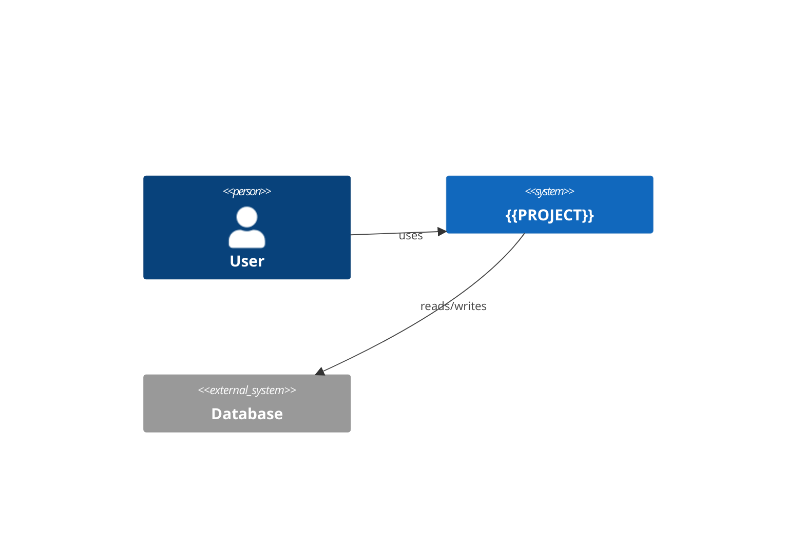

# Architecture

One page. Keep it current; history goes to decisions/.

## Context
Who uses the system and which external systems it talks to.

## Containers
| Container | Tech | Responsibility | Deployed where |
|---|---|---|---|
| web | Next.js | UI + server actions | Dokploy |
| db | Postgres | data | Dokploy / Supabase |

## Key flows
1. Authentication: …
2. Main business flow: …

## Constraints and invariants
- Tenant model: {{TENANT}}.
